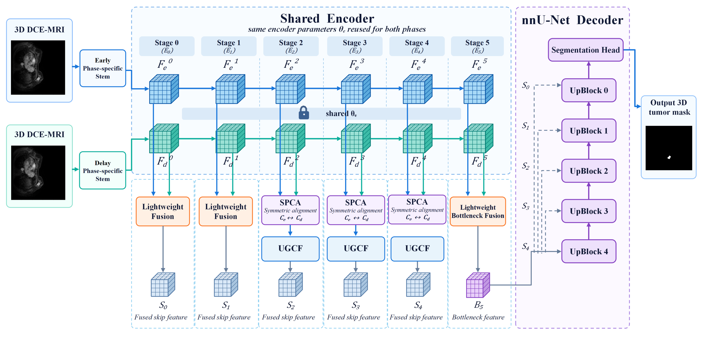
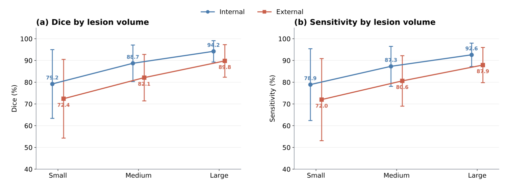
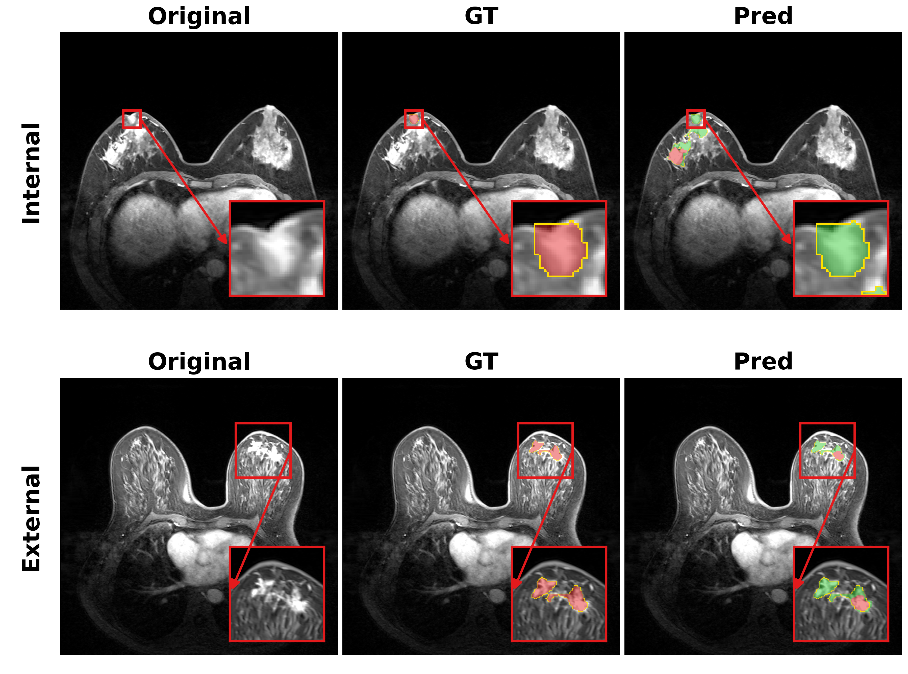

# Breast-DCE-MRI-Dual-Segments

## Structure-Preserving Cross-Phase Alignment and Uncertainty-Guided Fusion for Dual-Phase DCE-MRI Breast Tumor Segmentation

<p align="center">
  <b>Dual-phase 3D breast tumor segmentation with structure-preserving cross-phase alignment and uncertainty-guided feature fusion.</b>
</p>

<p align="center">
  <a href="https://github.com/si-yuan20/Breast-DCE-MRI-Dual-Segments"></a>
  
  
  
  
</p>

---

## Overview

Dynamic contrast-enhanced magnetic resonance imaging (DCE-MRI) provides complementary tumor information across enhancement phases. However, direct multi-phase fusion is affected by two practical challenges: residual spatial mismatch between sequential acquisitions and spatially varying prediction reliability across tumor interiors, boundaries, and low-contrast regions.

This work follows an **alignment-before-fusion** strategy for dual-phase 3D breast tumor segmentation:

- **Phase-specific shallow stems** preserve enhancement-dependent appearance cues.
- A **parameter-shared 3D encoder** maps both phases into a comparable semantic space.
- **Structure-Preserving Cross-Phase Alignment (SPCA)** estimates bounded residual displacements in a shared structural representation.
- **Uncertainty-Guided Cross-Phase Fusion (UGCF)** adaptively integrates aligned features using supervised predictive entropy, cross-phase prediction disagreement, and feature differences.
- A hierarchical **3D decoder** reconstructs the final volumetric tumor mask.

<p align="center">
  
</p>

<p align="center">
  <b>Figure 1.</b> Overall architecture of the proposed dual-phase 3D breast tumor segmentation framework.
</p>

---

## Method

### Structure-Preserving Cross-Phase Alignment

Rigid preprocessing removes most global translation and rotation between the early and delayed enhancement phases, but local spatial offsets may remain because of respiration, subtle patient motion, and breast deformation. SPCA performs residual alignment in a shared structural feature space rather than directly minimizing phase-dependent intensity differences.

Its main operations include shared structural projection, local symmetric cross-phase correspondence, bounded bidirectional residual displacement prediction, differentiable 3D warping, and structural regularization.

### Uncertainty-Guided Cross-Phase Fusion

UGCF estimates local reliability from supervised auxiliary segmentation predictions. Normalized predictive entropy serves as a spatial uncertainty proxy, while cross-phase prediction disagreement and aligned feature differences provide complementary evidence for adaptive fusion.

The design separates **where the phases should be aligned** from **how much each aligned phase should contribute** to the final representation.

---

## Study Design

### Internal Cohort

- **296 patients**
- Guangxi Medical University Cancer Hospital
- Retrospective pretreatment breast DCE-MRI cohort
- Early and delayed enhancement phases
- Manual 3D tumor annotations
- Patient-level five-fold cross-validation

### Independent External Cohort

- **100 public cases**
- Yunnan Cancer Hospital breast DCE-MRI dataset
- One pre-contrast and five post-contrast acquisitions
- The second and fifth post-contrast acquisitions were selected as the early and delayed enhancement phases
- No external case was used for training, model selection, early stopping, hyperparameter optimization, or threshold tuning

---

## Main Results

### Internal Five-Fold Cross-Validation

| Method | Dice (%) | IoU (%) | Sensitivity (%) | Precision (%) | HD95 (mm) | ASSD (mm) |
|---|---:|---:|---:|---:|---:|---:|
| 3D U-Net | 78.62 ± 14.83 | 67.09 ± 18.94 | 77.31 ± 16.42 | 80.16 ± 15.23 | 23.47 ± 24.86 | 13.96 ± 9.34 |
| V-Net | 79.45 ± 14.21 | 68.09 ± 18.38 | 78.23 ± 15.66 | 80.86 ± 14.91 | 22.16 ± 23.31 | 10.52 ± 8.88 |
| nnU-Net v2 | 84.96 ± 11.84 | 75.53 ± 16.52 | 83.74 ± 13.12 | 86.39 ± 12.26 | 16.82 ± 18.37 | 9.36 ± 6.78 |
| UNETR | 81.73 ± 13.26 | 71.09 ± 17.68 | 80.26 ± 14.66 | 83.42 ± 13.91 | 20.37 ± 21.52 | 11.71 ± 7.95 |
| Swin UNETR | 83.58 ± 12.31 | 73.56 ± 16.87 | 82.20 ± 13.54 | 85.16 ± 12.94 | 18.34 ± 19.87 | 7.03 ± 7.31 |
| MedNeXt | 85.42 ± 11.12 | 76.07 ± 15.71 | 84.06 ± 12.48 | 87.01 ± 11.73 | 16.03 ± 17.81 | 6.18 ± 6.46 |
| SegMamba | 86.13 ± 10.64 | 77.07 ± 15.21 | 84.91 ± 11.96 | 87.55 ± 11.21 | 17.37 ± 16.94 | 6.91 ± 6.17 |
| **Proposed method** | **87.54 ± 9.69** | **79.08 ± 14.21** | **86.42 ± 10.98** | **88.84 ± 10.27** | **14.18 ± 15.62** | **4.42 ± 5.71** |

### Independent External Test Cohort

| Method | Dice (%) | IoU (%) | Sensitivity (%) | Precision (%) | HD95 (mm) | ASSD (mm) |
|---|---:|---:|---:|---:|---:|---:|
| 3D U-Net | 71.86 ± 18.42 | 59.21 ± 21.37 | 70.44 ± 19.66 | 73.52 ± 18.93 | 31.47 ± 32.18 | 10.82 ± 12.91 |
| V-Net | 72.64 ± 17.96 | 60.13 ± 20.94 | 71.18 ± 19.08 | 74.35 ± 18.42 | 30.18 ± 30.96 | 10.31 ± 12.26 |
| nnU-Net v2 | 78.73 ± 14.86 | 66.73 ± 18.92 | 77.16 ± 16.24 | 80.55 ± 15.32 | 23.14 ± 24.61 | 7.46 ± 9.08 |
| UNETR | 75.36 ± 16.47 | 62.84 ± 20.06 | 73.74 ± 17.71 | 77.25 ± 16.93 | 27.23 ± 28.19 | 9.04 ± 10.73 |
| Swin UNETR | 77.14 ± 15.38 | 64.89 ± 19.34 | 75.63 ± 16.66 | 78.89 ± 15.87 | 24.91 ± 26.47 | 8.17 ± 9.82 |
| MedNeXt | 79.62 ± 14.21 | 67.82 ± 18.37 | 78.08 ± 15.61 | 81.40 ± 14.72 | 21.88 ± 23.16 | 7.02 ± 8.51 |
| SegMamba | 80.41 ± 13.72 | 68.86 ± 17.86 | 78.94 ± 14.95 | 82.11 ± 14.23 | 20.73 ± 22.08 | 6.63 ± 8.07 |
| **Proposed method** | **82.37 ± 12.86** | **71.49 ± 16.94** | **81.03 ± 14.11** | **83.94 ± 13.36** | **18.96 ± 20.37** | **5.91 ± 7.26** |

---

## Component Ablation

| Early Phase | Delayed Phase | SPCA | UGCF | Dice (%) | HD95 (mm) |
|:---:|:---:|:---:|:---:|---:|---:|
| ✓ |  |  |  | 81.76 ± 13.41 | 21.36 ± 22.84 |
|  | ✓ |  |  | 80.92 ± 13.87 | 22.14 ± 23.51 |
| ✓ | ✓ |  |  | 84.18 ± 11.91 | 18.03 ± 19.44 |
| ✓ | ✓ | ✓ |  | 85.71 ± 10.98 | 16.32 ± 17.80 |
| ✓ | ✓ |  | ✓ | 85.26 ± 11.21 | 16.89 ± 18.33 |
| ✓ | ✓ | ✓ | ✓ | **87.54 ± 9.69** | **14.18 ± 15.62** |

The ablation results support complementary contributions from structural alignment and reliability-guided fusion.

---

## Lesion-Volume Subgroup Analysis

Lesion volume was stratified using fixed thresholds derived from the internal cohort:

- **Small:** < 2.2 cm³
- **Medium:** 2.2 to < 5.1 cm³
- **Large:** ≥ 5.1 cm³

The same absolute thresholds were applied to the independent external cohort without recalibration.

| Cohort | Method | Small Dice (%) | Small Sensitivity (%) | Medium Dice (%) | Medium Sensitivity (%) | Large Dice (%) | Large Sensitivity (%) |
|---|---|---:|---:|---:|---:|---:|---:|
| Internal | nnU-Net v2 | 75.0 ± 18.9 | 73.8 ± 20.1 | 85.4 ± 10.4 | 84.0 ± 11.2 | 93.9 ± 5.8 | 92.8 ± 6.4 |
| Internal | MedNeXt | 75.9 ± 17.8 | 74.0 ± 19.0 | 85.8 ± 9.8 | 84.4 ± 10.7 | 94.0 ± 5.4 | 93.2 ± 6.1 |
| Internal | SegMamba | 76.5 ± 17.0 | 75.0 ± 18.2 | 86.5 ± 9.1 | 85.1 ± 10.0 | **94.8 ± 5.0** | 94.0 ± 5.7 |
| Internal | **Proposed method** | **78.6 ± 15.8** | **80.2 ± 16.5** | **88.0 ± 8.4** | **88.7 ± 9.2** | 93.5 ± 4.9 | **94.1 ± 5.4** |
| External | nnU-Net v2 | 67.0 ± 21.8 | 65.5 ± 22.4 | 79.0 ± 12.8 | 77.5 ± 13.6 | 87.0 ± 8.7 | 85.4 ± 9.4 |
| External | MedNeXt | 68.5 ± 20.9 | 66.5 ± 21.5 | 80.0 ± 12.1 | 78.4 ± 13.0 | 87.4 ± 8.3 | 86.2 ± 9.0 |
| External | SegMamba | 69.5 ± 19.8 | 67.5 ± 20.4 | 81.0 ± 11.6 | 79.3 ± 12.5 | 87.9 ± 8.0 | 87.0 ± 8.6 |
| External | **Proposed method** | **72.9 ± 18.1** | **75.4 ± 18.9** | **82.7 ± 10.7** | **83.8 ± 11.6** | **90.4 ± 7.5** | **91.2 ± 8.1** |

The proposed method achieved the highest small-lesion Dice among the evaluated mainstream 3D comparison methods in both cohorts, reaching **78.6%** internally and **72.9%** externally.

<p align="center">
  
</p>

<p align="center">
  <b>Figure 2.</b> Dice and sensitivity across small, medium, and large lesion-volume subgroups in the internal and external cohorts.
</p>

---

## Failure Cases

Representative failure cases mainly involve strong background parenchymal enhancement, heterogeneous intratumoral enhancement, diffuse tumor extension, poorly defined lesion margins, and anatomically complex regions.

These cases indicate that structural alignment can reduce cross-phase inconsistency, but it cannot recover a clear tumor boundary when both phases provide weak or ambiguous local evidence.

<p align="center">
  
</p>

<p align="center">
  <b>Figure 3.</b> Representative failure cases from the internal and independent external cohorts.
</p>

---

## Data Availability

### Internal Clinical Cohort

The internal clinical dataset contains protected patient information and is not publicly distributed because of institutional privacy and ethical restrictions. Any potential access request is subject to institutional policy, ethics approval, and applicable data-use agreements.

### External Public Cohort

The independent external evaluation uses the publicly available breast DCE-MRI dataset released by Zhang *et al.* and hosted on Zenodo.

**Dataset DOI:** `10.5281/zenodo.8068383`

Please cite the original dataset and its associated publication when using these data.

---

## Installation

Clone the repository:

```bash
git clone https://github.com/si-yuan20/Breast-DCE-MRI-Dual-Segments.git
cd Breast-DCE-MRI-Dual-Segments
```

Install the project according to the environment files and package configuration included in the repository. The main implementation is based on Python, PyTorch, MONAI, SimpleITK, NumPy, SciPy, and related medical-image processing libraries.

```bash
pip install -e .
```

---

## Training and Evaluation

Before training, configure the local nnU-Net paths:

```bash
export nnUNet_raw=/path/to/nnUNet_raw
export nnUNet_preprocessed=/path/to/nnUNet_preprocessed
export nnUNet_results=/path/to/nnUNet_results
```

Available experiment scripts include:

```bash
bash nnunet_train.sh
bash run.sh
bash test_all_networks.sh
```

Please verify dataset IDs, folds, trainer settings, GPU assignments, and local paths before execution.

---

## Figure Files

This README displays only three manuscript figures:

```text
figure/figure3_architecture.png
figure/figure9_lesion_volume.png
figure/figure10_failure_cases.png
```

If your local filenames differ, update the corresponding relative paths in `README.md`.

---

## Reproducibility Notes

For reproducible evaluation:

- split data at the patient level rather than the slice level;
- keep the independent external cohort completely separate from model development;
- use identical internal folds for compared methods;
- evaluate complete 3D volumes;
- report both region-overlap and boundary metrics;
- keep lesion-volume thresholds fixed when evaluating the external cohort;
- document phase selection, registration, preprocessing, training, and inference settings.

---

## Citation

The manuscript is currently under review. Publication metadata and DOI will be updated after acceptance.

```bibtex
@article{zhao2026crossphase,
  title   = {Structure-Preserving Cross-Phase Alignment and Uncertainty-Guided Fusion for Dual-Phase DCE-MRI Breast Tumor Segmentation},
  author  = {Zhao, Sichao and Feng, Kanghua and Chen, Junjun and Su, Luowei and Li, Minghao and Zheng, Kehong and Lai, Wanting and Gao, Rong and Li, Weidong and Dong, Jianwei and Liu, Ying and Qiu, Xuejun},
  journal = {Under Review},
  year    = {2026}
}
```

---

## Code Availability

The source code is publicly available at:

**https://github.com/si-yuan20/Breast-DCE-MRI-Dual-Segments**

Model checkpoints, pretrained weights, and additional reproducibility resources should only be considered publicly available when they are explicitly included in the repository or in a tagged release.

---

## License

Please refer to the repository `LICENSE` file once provided. Until a license is explicitly included, redistribution and reuse remain subject to the repository owner's terms.

---

## Contact

For questions related to the method, implementation, or reproducibility, please open a GitHub issue or contact the corresponding author listed in the manuscript.

---

<p align="center">
  <b>Breast-DCE-MRI-Dual-Segments</b><br>
  Structure-preserving alignment before reliability-guided cross-phase fusion.
</p>
